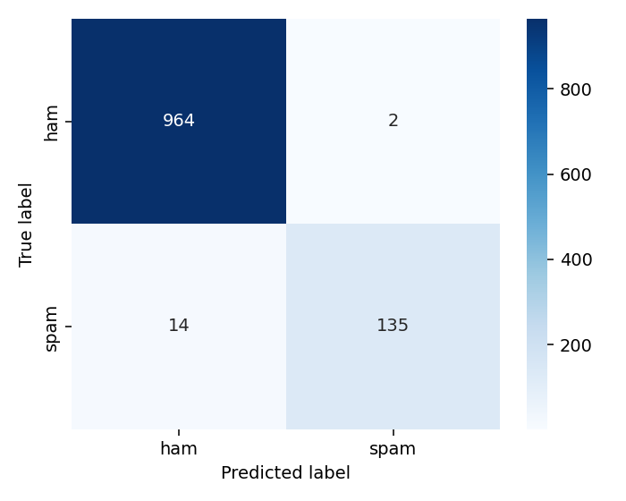

## Spam SMS Detection (CLI)

Production-style, terminal-friendly SMS spam classifier built in Python. The project mirrors a real-world ML pipeline: data loading, preprocessing (cleaning + TF‑IDF), model training (NB/LR/SVM), evaluation (metrics + confusion matrix), and a neat CLI to test custom messages.



### Folder Structure
```
Spam_SMS_Detection/
├── data/                     # dataset CSV file (place Kaggle CSV here)
├── src/
│   ├── preprocessing.py      # text cleaning + TF-IDF feature extraction
│   ├── models.py             # ML models (training & saving)
│   ├── evaluate.py           # evaluation metrics & confusion matrix
│   └── utils.py              # helper functions
├── models/                   # saved trained model + vectorizer
├── results/                  # evaluation artifacts (plots/metrics)
├── demo.py                   # main script to run pipeline + predict messages
├── requirements.txt          # dependencies
└── README.md                 # documentation
```

### Dataset
Use the Kaggle dataset: `https://www.kaggle.com/datasets/uciml/sms-spam-collection-dataset`.

Download the CSV and place it at: `data/spam.csv`

The script is robust to common Kaggle column names (e.g., `v1` and `v2`) and will normalize to `label` and `text` internally.

### Setup
```bash
python -m venv venv
source venv/bin/activate  # on macOS/Linux
pip install -r requirements.txt
```

### Train the models
```bash
python demo.py --dataset data/spam.csv
```
This will:
- Clean and vectorize text with TF‑IDF
- Train Naive Bayes, Logistic Regression, and Linear SVM
- Evaluate on a holdout set, print metrics, and save a confusion matrix plot
- Persist the best model and the TF‑IDF vectorizer under `models/`

Artifacts:
- `models/best_model.joblib`
- `models/vectorizer.joblib`
- `results/confusion_matrix.png`
- `results/metrics.json`

### Predict a custom message (CLI)
```bash
python demo.py --message "Congratulations! You won a free iPhone"
# Output: SPAM

python demo.py --message "Let's meet at 5pm today"
# Output: NOT SPAM
```

If no trained model exists, and a dataset is available at `--dataset`, the script will train first and then predict.

### Example Console Output
```
[1/5] Loading dataset ✅
[2/5] Preprocessing & vectorizing ✅
[3/5] Training models ✅
[4/5] Evaluating models ✅
  - NaiveBayes  | Acc: 0.97  P: 0.95  R: 0.93  F1: 0.94
  - LogReg      | Acc: 0.98  P: 0.97  R: 0.95  F1: 0.96
  - LinearSVM   | Acc: 0.98  P: 0.98  R: 0.96  F1: 0.97  <-- best
[5/5] Saving artifacts ✅
Best model: LinearSVM
Confusion matrix saved to results/confusion_matrix.png
```

### Notes
- Stopword removal uses scikit-learn's English stop words.
- TF‑IDF parameters are tuned for strong baseline performance (`ngram_range=(1, 2)`, `max_features=5000`).
- The project is fully modular and production-ready for a portfolio showcase.

License: MIT (see `LICENSE`).


